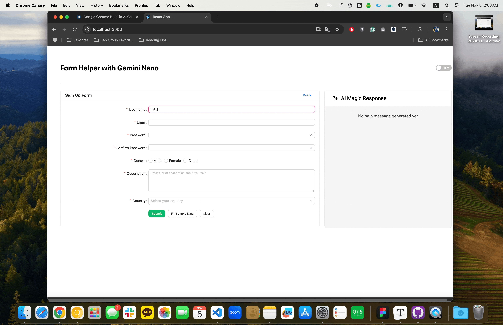

# Form Helper Chrome Playground

This project serves as a playground for testing and demonstrating the capabilities of the `form-helper-chrome` package. It provides a real-time form helper using Chrome's built-in AI (Gemini Nano) to enhance form error handling.

## Features

- Real-time AI assistance with Chrome's Gemini Nano
- Interactive form with instant validation
- AI-generated help messages for error correction
- Responsive design with Ant Design

## Quick Start

1. Clone the repository
2. Run `npm install` to install dependencies
3. Run `npm start` to start the development server

## Usage

1. Fill out the form to see real-time validation and AI help
2. Use 'Fill Sample Data' to generate error examples
3. Click 'Clear' to reset the form

